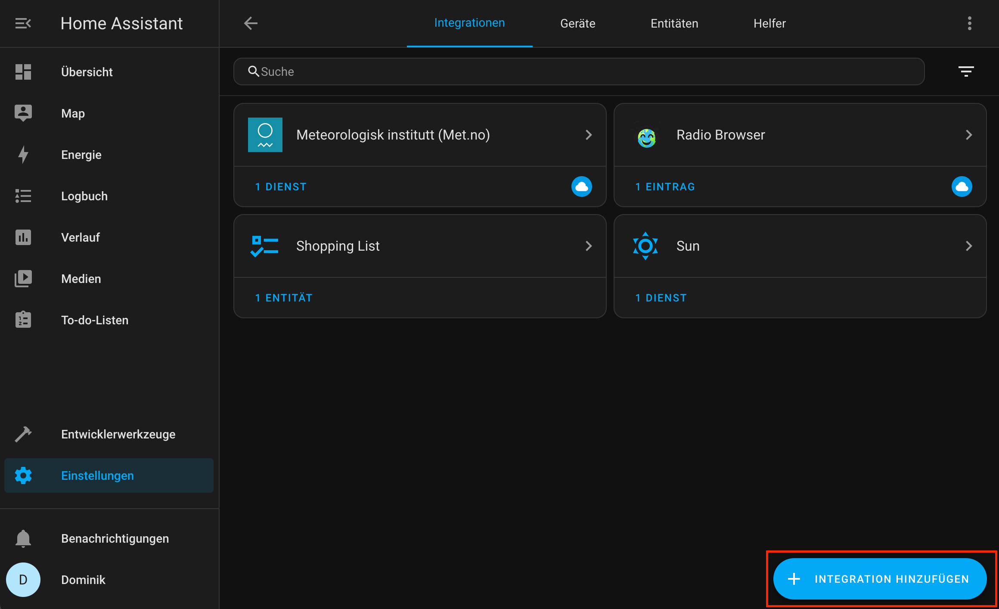

# Becker CentralControl HAS

Control your Centronic, CentronicPLUS and B-Tronic devices with Homeassistant.
Requires a fully set-up CC31, CC41 or CC51.

## Device support:

- All cover-types (Roller-Shutter, Venetian, Screen, Awning, etc.) are supported.
  _Some functions might be unsupported right now (e.g. slat)_
- Dimmer
- Switch (All CentronicPLUS, Centronic B-Tronic and internal switches)
- Sensors with Sun, Wind, Rain (SC911+, SC811+, other devices are untested or unsupported)  
  _Values are unmapped, sensor values will be:_
  * Sun: 0 - 15
  * Wind: 0 - 11
  * Rain: 0 (no rain) or 1 (rain)

## Usage:


Got to settings > add integration.


Add the CentralControl integration.


Configure the host: `http://$CENTRAL_CONTROL_IP_ADR/cgi-bin/cc51rpc.cgi`
Leave the cookie field empty.


If everything went smoothly you should be presented a list of devices.
_Note:_ Sometimes only 1 device is listed. After selection the other devices will be listed.


Devices are mapped to entities and added accordingly

## Zero-Conf / MDNS / AVAHI

Currently not supported.

# Dev Notes:

## CentralControl API

The API allows to:

- list devices
- send commands
- get the current state of devices which support feedback

See [central_control.py](central_control.py) for a more comprehensive guide on API usage.

## Manual Installation:

_Please use HACS to install this integration, this is mostly developer notes:_

Navigate to the `$HASS_CONFIG_DIR/custom_components` directory.

Clone the repository: `git clone https://github.com/DominikStarke/becker_centralcontrol_has.git`

Restart Homeassistant to load the new integration.

_Alternatively_ you can also get the code as [zip file](https://github.com/DominikStarke/becker_centralcontrol_has/archive/refs/heads/main.zip) and unpack it manually to the `$HASS_CONFIG_DIR/custom_components` directory

## Forward tunneling (MacOS development in HASS Container)

Due to limitations of the Linux VM of Docker on MacOS we cannot use --network host.
That means it's not possible to connect to a CentralControl on the same Network as the host machine.

It's possible to use ssh to open a forward tunnel:

```
ssh -fN -L 8080:$CENTRAL_CONTROL_IP_ADR:80 $CENTRAL_CONTROL_IP_ADR
```

Then during integration setup use `http://host.docker.internal:8080/cgi-bin/cc51rpc.cgi` as hostname.

## Contributing

Contributions are welcome
